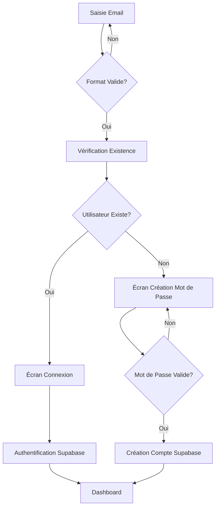

# 🔐 Flux d'Inscription/Connexion - Ges-Cab

## Vue d'ensemble du nouveau flux

Le système d'authentification a été modernisé pour offrir une expérience utilisateur fluide et sécurisée.

## 🚀 Fonctionnement du Flux

### 1️⃣ **Saisie de l'Email**
- L'utilisateur saisit son adresse email
- Validation automatique du format email
- Vérification de l'existence du compte

### 2️⃣ **Routage Intelligent**
- **Si l'utilisateur existe** → Redirection vers la connexion
- **Si l'utilisateur n'existe pas** → Redirection vers la création de compte

### 3️⃣ **Connexion (Utilisateur Existant)**
- Saisie du mot de passe
- Authentification via Supabase Auth
- Redirection automatique vers le tableau de bord

### 4️⃣ **Création de Compte (Nouvel Utilisateur)**
- Interface dédiée de création de mot de passe
- Validation en temps réel des critères de sécurité
- Confirmation du mot de passe obligatoire
- Création automatique du compte dans Supabase Auth

## 🔒 Critères de Sécurité des Mots de Passe

### **Obligatoire (Minimum Supabase)**
- ✅ **6 caractères minimum** (requis par Supabase)

### **Recommandés (Force du mot de passe)**
- ✅ Au moins une **majuscule** (A-Z)
- ✅ Au moins une **minuscule** (a-z)  
- ✅ Au moins un **chiffre** (0-9)
- ✅ Au moins un **caractère spécial** (!@#$%^&*...)

### **Niveaux de Sécurité**
- 🔴 **Faible** : Critères minimum seulement
- 🟡 **Moyen** : 3-4 critères respectés
- 🟢 **Fort** : Tous les critères respectés

## 🎯 Expérience Utilisateur

### **Validation en Temps Réel**
- ✅ Indicateurs visuels des critères respectés
- ✅ Messages d'erreur contextuels
- ✅ Désactivation du bouton si critères non respectés

### **Messages d'Erreur Personnalisés**
- Email invalide
- Mots de passe non correspondants
- Critères de sécurité non respectés
- Erreurs Supabase traduites en français

### **Animations et Feedback**
- Transitions fluides entre les étapes
- Indicateurs de chargement
- Notifications toast pour les actions importantes

## 🛠️ Implémentation Technique

### **Composants Principaux**
- `LoginScreen.jsx` - Orchestrateur du flux
- `CreatePasswordScreen.jsx` - Interface de création de compte
- `SupabaseAuthContext.jsx` - Gestion de l'authentification

### **Méthodes d'Authentification**
```javascript
// Vérification de l'existence d'un utilisateur
const { exists } = await checkUserExists(email);

// Création d'un nouveau compte
await createAccount(email, password);

// Connexion utilisateur existant  
await signIn(email, password);
```

### **Validation Côté Client**
```javascript
import { validatePassword, validateEmail } from '@/lib/authValidation';

// Validation email
const { isValid } = validateEmail(email);

// Validation mot de passe
const { isMinimumValid, securityLevel } = validatePassword(password);
```

## 🔄 Flux de Données



## 🎨 Styles et Design

### **Couleurs Utilisées**
- **Primaire** : Bleu/Indigo gradient
- **Succès** : Vert (`text-green-500`)
- **Erreur** : Rouge (`text-red-500`) 
- **Attention** : Jaune (`text-yellow-500`)
- **Neutre** : Gris slate (`text-slate-400`)

### **Animations**
- Transitions Framer Motion pour la fluidité
- Micro-interactions sur les champs de saisie
- Indicateurs de progression visuels

## 📊 Gestion des Erreurs

### **Erreurs Supabase Traduites**
- "User already registered" → "Un compte avec cet email existe déjà"
- "Invalid login credentials" → "Email ou mot de passe incorrect"
- "Email not confirmed" → "Votre email n'a pas été confirmé"
- "Too many requests" → "Trop de tentatives, attendez quelques minutes"

### **Logging et Audit**
- Tentatives de connexion loggées
- Créations de comptes trackées
- Erreurs d'authentification enregistrées

## 🚀 Déploiement et Configuration

### **Variables d'Environnement Requises**
```bash
# Supabase (obligatoire)
VITE_SUPABASE_URL=https://votre-projet.supabase.co
VITE_SUPABASE_ANON_KEY=votre_cle_anon

# Rate Limiting (optionnel)
VITE_API_RATE_LIMIT=50
VITE_RATE_LIMIT_WINDOW_MS=60000
```

### **Configuration Supabase Recommandée**
1. **Row Level Security (RLS)** activé sur toutes les tables
2. **Policies** d'accès définies pour chaque table
3. **Email confirmation** optionnelle selon le besoin
4. **Rate limiting** au niveau serveur pour la production

## 📱 Compatibilité

- ✅ **Desktop** : Expérience complète
- ✅ **Mobile** : Interface responsive
- ✅ **Tablettes** : Optimisé pour les écrans moyens
- ✅ **Accessibilité** : Labels et navigation clavier

## 🔧 Maintenance

### **Tests Recommandés**
- [ ] Test de création de compte avec email valide
- [ ] Test de connexion avec utilisateur existant
- [ ] Test de validation des mots de passe faibles
- [ ] Test de gestion des erreurs réseau
- [ ] Test de redirection après authentification

### **Monitoring**
- Taux de succès des inscriptions
- Taux de succès des connexions  
- Temps de réponse de l'authentification
- Erreurs fréquentes à optimiser

---

✨ **Le nouveau flux d'authentification offre une expérience moderne, sécurisée et intuitive pour tous les utilisateurs de Ges-Cab !**